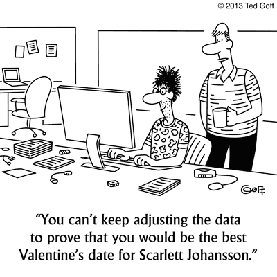

## Agenda

1. Course Overview
2. Review of Regression
3. Dinner Break
4. Classification and Ethics
5. Basic Feature Engineering
6. Vocabulary

# Course Overview

## Expectations and assignments

1. Homework assignments
2. Exams
3. Modeling Project
4. Course Policies
5. My expectations for you

## Introductions

### About me
- BS in computer science (2000)
- MBA focused on the tech side of marketing (2007)
- PhD conducting quantitative research in marketing (2015)

### About you?
  - background
  - goals for this program

## Basic concepts in Machine Learning

- What is a data scientist?
- What is the role of judgment in machine learning?
- What are the differences between machine learning, statistics and econometrics?
- When is "mere" correlation enough?

# Review of Regression

## Single Variable

### Setup

```{r setup, message=FALSE, warning=FALSE, size="tiny"}
knitr::opts_chunk$set(echo = TRUE, message = FALSE, warning = FALSE)
library(tidyverse)
wine = read_rds("../resources/wine.rds")
```

### Basic model

```{r}
library(moderndive)
wine <- wine %>% 
  mutate(bordeaux=(province=="Bordeaux"))
m1 <- lm(price ~ points, data = wine)
get_regression_table(m1)
```
## Let's draw it

## Multiple regression

```{r}
m2 <- lm(price ~ points+bordeaux, data = wine)
get_regression_table(m2)
```

## Let's draw it

## How about with an interaction?

```{r}
m3 <- lm(price~points*bordeaux, data = wine)
get_regression_table(m3)
```

## Let's draw it

## Model diagnostics 

```{r eval=FALSE}
get_regression_summaries(m1)
get_regression_summaries(m2)
get_regression_summaries(m3)
```


```{r echo=FALSE}
get_regression_summaries(m1)
get_regression_summaries(m2)
get_regression_summaries(m3)
```


## Moving to an ML framework

### Split sample using Caret

```{r}
library(caret)
set.seed(504)
train_index <- createDataPartition(wine$price, times = 1, p = 0.8, list = FALSE)
train <- wine[train_index, ]
test <- wine[-train_index, ]
```

### Run models on training data

```{r}
m1 <- lm(price~points, data = train)
m2 <- lm(price~points+bordeaux, data = train)
m3 <- lm(price~points*bordeaux, data = train)
```

## Compare RMSE across models

```{r}
r1 <- get_regression_points(m1, newdata = test) %>% 
  drop_na(residual) %>% 
  mutate(sq_residuals = residual^2) %>% 
  summarize(rmse = sqrt(mean(sq_residuals)))
r2 <- get_regression_points(m2, newdata = test) %>% 
  drop_na(residual) %>% 
  mutate(sq_residuals = residual^2) %>% 
  summarize(rmse = sqrt(mean(sq_residuals)))
r3 <- get_regression_points(m3, newdata = test) %>% 
  drop_na(residual) %>% 
  mutate(sq_residuals = residual^2) %>% 
  summarize(rmse = sqrt(mean(sq_residuals)))
```
&nbsp;

* Single: `r r1`
* Multiple: `r r2`
* Interaction: `r r3`

::: notes

Note that RMSE is greater than on the initial regressions. Why?

:::

## Exercise (30m)

1. Break into groups
2. Load the wine data set
3. Create a visualization of the relationship between points and price
4. **Bonus:** Color the observations based on whether the wine is from Bordeaux 
5. **Double Bonus:** Include regression lines for Bordeaux vs. not
6. **Triple Bonus:** Show regression lines for points x Bordeaux interaction

## Dinner break and (virtual) high fives




# Classification and Ethics 

## The math of it...

Suppose I'm trying to predict gender based on height. We start by defining the outcome and predictors and creating training and test data.

```{r}
library(dslabs)
data(heights)
y <- heights$sex
x <- heights$height
set.seed(504)
test_index <- createDataPartition(y, times = 1, p = 0.5, list = FALSE)
test_set <- heights[test_index, ]
train_set <- heights[-test_index, ]
```

Note: this vignette is adapted from [this book](https://rafalab.github.io/dsbook/introduction-to-machine-learning.html)

## Guessing.

Let’s start by developing the simplest possible machine algorithm: guessing the outcome.
```{r}
y_hat <- sample(c("Male", "Female"), length(test_index), replace = TRUE) %>%
  factor(levels = levels(test_set$sex))
```

The overall accuracy is simply defined as the overall proportion that is predicted correctly:
```{r}
mean(y_hat == test_set$sex)
```

## Let's do better...

```{r echo=F}
heights %>% group_by(sex) %>% summarize(mean(height), sd(height))
```
## A simple predictive model

### **Rule:** Predict male if observation is within 2 standard deviations

```{r}
y_hat <- ifelse(x > 62, "Male", "Female") %>% 
  factor(levels = levels(test_set$sex))

mean(y == y_hat)
```

The accuracy goes up from 0.50 to about 0.80!!

## Let's optimize

```{r}
cutoff <- seq(61, 70)
accuracy <- map_dbl(cutoff, function(x){
  y_hat <- ifelse(train_set$height > x, "Male", "Female") %>% 
    factor(levels = levels(test_set$sex))
  mean(y_hat == train_set$sex)
})

max(accuracy)
```

which is much higher than 0.5!! 

## The cutoff resulting in this accuracy is:

```{r}
best_cutoff <- cutoff[which.max(accuracy)]
best_cutoff
```

## How does it do on the test data?

```{r}
y_hat <- ifelse(test_set$height > best_cutoff, "Male", "Female") %>% 
  factor(levels = levels(test_set$sex))
y_hat <- factor(y_hat)
mean(y_hat == test_set$sex)
```


## Confusion matrix

```{r}
table(predicted = y_hat, actual = test_set$sex)
```

what do you see?

## Accuracy by sex

```{r echo=F}
test_set %>% 
  mutate(y_hat = y_hat) %>%
  group_by(sex) %>% 
  summarize(accuracy = mean(y_hat == sex))
```
&nbsp;

There is an imbalance in the force! 
We are literally calling almost half of the females male! 


So why is the overall accuracy so high then? 

## Moral of the story

...too many men.

## Other ethical issues

- Demographic data
- Profit optimizing
- Autonomous cars
- Recommendation engines
- Criminal sentencing
- Choice of classification model
- Killer robots

Reasonable people will disagree over subtle matters of right and wrong... thus, the important part of data ethics is committing to *consider* the ethical consequences of your choices. 

The difference between "regular" ethics and data ethics is that algorithms scale really easily. Thus, seemingly small decisions can have wide-ranging impact.

# Vocabulary

## ML Terms

**Definition of ML:** using data to find a function that minimizes prediction error.

- Features
- Variables
- Outcome variable
- Regression
- RMSE
- Classification
- Confusion matrix
- Split Samples
