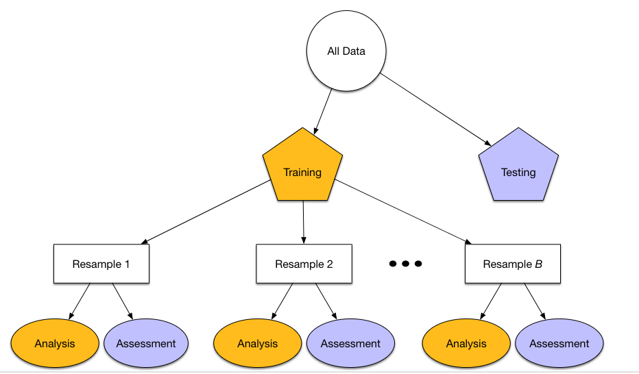

## Agenda

1. Review of Homework 1
2. Feature Engineering I
3. Dinner Break
4. The Caret framework
5. Vocabulary

## Setup

```{r setup, message=FALSE, warning=FALSE}
knitr::opts_chunk$set(echo = TRUE, message = FALSE, warning = FALSE)
library(tidyverse)
wine = read_rds("../resources/wine.rds")
```

# Basic feature engineering

## Exercise (20m)

1. Gather in groups
2. Identify 3 "interesting" features of the wine dataset
3. **Bonus** Identify the wine variety (or varieties) that Roger Voss seems to dislike compared to the other critics

## Categorical vs. Continuous Variables

- What is a categorical variable?
- What is a continuous variable?
- Why do we need to "look" at the data before modeling it?

## Categorical Example 1

```{r echo=T}
wine %>% 
  mutate(roger=taster_name=="Roger Voss") %>% 
  mutate(pinot_gris=variety=="Pinot Gris") %>% 
  drop_na(roger) %>% 
  group_by(roger, pinot_gris) %>% 
  summarise(points = mean(points)) %>% 
  ggplot() +
  aes(x = pinot_gris, y = points, color = roger) +
  geom_line(aes(group = roger)) +
  geom_point()
```

## Categorical Example 2

```{r echo=T}
wine %>% 
  filter(province=="Oregon") %>% 
  group_by(year) %>% 
  summarise(price=mean(price)) %>% 
  ggplot(aes(year,price))+
  geom_line()+
  labs(title = "Oregon wine over the years")
```

## Encoding categorical features: few dummies

```{r}
library(fastDummies)
wine %>% 
  select(taster_name) %>% 
  dummy_cols() %>% 
  select(1:4) %>% 
  head()
```

## Encoding categorical features: many dummies

```{r}
wine %>% 
  select(variety) %>%
  mutate(variety=fct_lump(variety,4)) %>%
  dummy_cols() %>% 
  head()
```

## Other types of engineered categorical features...

- Words or phrases in text
- A given time period
- An arbitrary numerical cut-off
- Demographic variables
- Etc.

## What about numerical features?

```{r echo=F}
wine %>%
  ggplot(aes(price))+
    geom_histogram()
```

## Take the natural log

```{r echo=F}
wine %>%
  ggplot(aes(log(price)))+
    geom_histogram()
```

## Engineering numeric features: Standardizing

- mean-centering $x-\bar{x}$
- scaling: $x/std(x)$

...allows for common scale across variables. Also helps reduce bias when interactions are included (i.e. eliminates variance inflation).

And there are [many other transformations](http://www.feat.engineering/numeric-one-to-many.html) that you can read about.

## Interaction effects

[This chapter](http://www.feat.engineering/detecting-interaction-effects.html) has a good overview of interactions. 

- start with domain knowledge
- use visualizations
- 3-way interactions exist, but are rare and sometimes hard to explain

## Dinner (and virtual high fives)


# The 'caret' package

## Philosophy




## Types of resampling

- [V-fold Cross-Validation](http://www.feat.engineering/resampling.html#cv)
- [Monte Carlo Cross-Validation](http://www.feat.engineering/resampling.html#monte-carlo-cross-validation)
- [The Bootstrap](http://www.feat.engineering/resampling.html#the-bootstrap)

## Typical setup

```{r}
library(caret)
wino <- wine %>% ## look ma, engineered features!
  mutate(fr=(country=="France")) %>%
  mutate(cab=str_detect(variety,"Cabernet")) %>% 
  mutate(lprice=log(price)) %>% 
  drop_na(fr, cab) %>% 
  select(lprice, points, fr, cab)

wine_index <- createDataPartition(wino$lprice, p = 0.8, list = FALSE)
wino_tr <- wino[ wine_index, ]
wino_te <- wino[-wine_index, ]

control <- trainControl(method="repeatedcv", number=5, repeats=3)
m1 <- train(lprice ~ .,
                data = wino_tr, 
                method = "lm",
                trControl = control)
```

Follow [this link](https://topepo.github.io/caret) for the full documentation on caret.

## Train vs. test

```{r}
m1
```

## Train vs. test

```{r}
wine_pred <- predict(m1, wino_te)
postResample(pred=wine_pred, obs = wino_te$lprice)
```


## Exercise (30-40 minutes)

1. Gather in groups
2. Create 5-10 new features (in addition to points)
3. Create training and test data
4. Use your new predictors to train a linear regression model for log(price)
5. Report RMSE on test set
6. Keep tweaking/engineering new features to lower the RMSE


# Parameter selection

## Stepwise selection is bad

Harrell (2015) provides a comprehensive indictment of the method that can be encapsulated by the statement:

> **“… if this procedure had just been proposed as a statistical method, it would most likely be rejected because it violates every principle of statistical estimation and hypothesis testing.”**

&nbsp;
Reference: Harrell, F. 2015. Regression Modeling Strategies. Springer.

## Engineer 9 features

```{r}
wino <- wine %>% 
  mutate(country=fct_lump(country,4)) %>%
  mutate(variety=fct_lump(variety,4)) %>% 
  mutate(lprice=log(price)) %>%
  select(lprice, points, country, variety) %>% 
  drop_na(.)

wino <- dummy_cols(wino, remove_selected_columns = T) %>% 
  select(-country_Other, -variety_Other) %>% 
  rename_all(funs(tolower(.))) %>% 
  rename_all(funs(str_replace_all(., "-", "_"))) %>% 
  rename_all(funs(str_replace_all(., " ", "_")))

head(wino) %>% 
  select(1:7)
```

## Basic Model

```{r}
wine_index <- createDataPartition(wino$lprice, p = 0.8, list = FALSE)
wino_tr <- wino[ wine_index, ]
wino_te <- wino[-wine_index, ]

m2 <- train(lprice ~ .,
                data = wino_tr, 
                method = "lm",
                trControl = control)
```

## Results (train)

```{r}
m2
```

## Results (test)

```{r}
wine_pred <- predict(m2, wino_te)
postResample(pred=wine_pred, obs = wino_te$lprice)
```

## Variable Importance (depends on model used)

```{r message=F}
# estimate variable importance
importance <- varImp(m2, scale=TRUE)
# plot importance
plot(importance)
```


## Recursive feature elimination


## Using recursive feature elimination in caret

```{r eval=FALSE}

x <- select(wino_tr,-lprice)
y <- wino_tr$lprice

control <- rfeControl(functions=rfFuncs, method="cv", number=2)
# run the RFE algorithm
results <- rfe(x, y, sizes=c(1:9), rfeControl=control)
# summarize the results
print(results)
# list the chosen features
predictors(results)
# plot the results
plot(results, type=c("g", "o"))

```

# Vocabulary

## Key Terms

- Feature Engineering
- Categorical Feature
- Continuous Feature
- Dummy
- Interaction
- Caret
- Model
- Resampling
- Training Data vs. Test Data
- Variable Importance
- 


