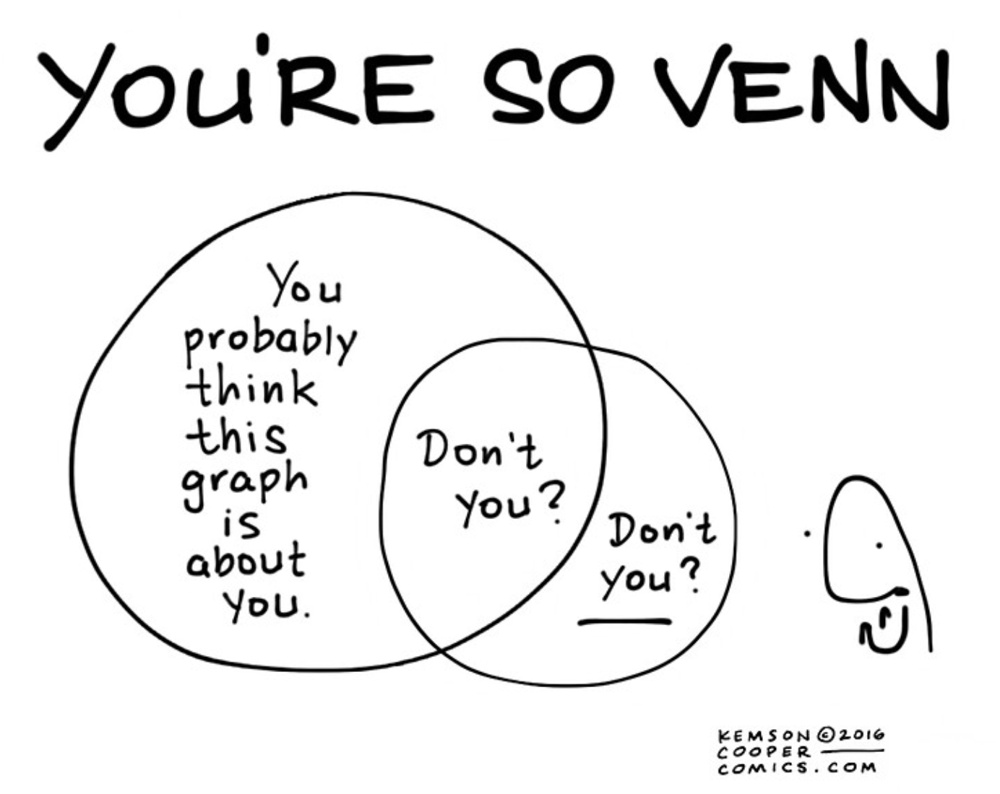

## Agenda

1. Review of Homework 3
2. RStudio Server and Parallel Processing
3. The Naive Bayes algorithm
4. Dinner break
5. Tidy text and bag of words
6. Group work
7. Vocabulary

# The Naive Bayes Algorithm

## Algorithm

$P(c|x) = \frac{P(x|c)P(c)}{P(x)} = \frac{P(c \space \& \space x)}{P(x)}$

## Setup

```{r setup, message=FALSE, warning=FALSE}
knitr::opts_chunk$set(echo = TRUE, message = FALSE, warning = FALSE)
library(tidyverse)
library(caret)
library(naivebayes)
library(fastDummies)
source('theme.R')

wine = read_rds("../resources/pinot.rds") %>% 
  select(-taster_name)
```

## Some basic features

```{r}
wino <- wine %>% 
  mutate(year_f = as.factor(year)) %>% 
  mutate(cherry = str_detect(description,"cherry")) %>% 
  mutate(chocolate = str_detect(description,"chocolate")) %>%
  mutate(earth = str_detect(description,"earth")) %>%
  select(-description, year)

glimpse(wino)
```

## A couple conditional probabilities

$p(Oregon | cherry) = \frac{p(Oregon \space\&\space Cherry)}{p(Cherry)}$

```{r}
oregon_and_cherry <- nrow(filter(wino, province=="Oregon" & cherry))/nrow(wino)
cherry <- nrow(filter(wino, cherry))/nrow(wino)
oregon_and_cherry/cherry
```

## How about New York?
$p(NY | cherry) = \frac{p(NY \space\&\space Cherry)}{p(Cherry)}$

```{r}
ny_and_cherry <- nrow(filter(wino, province=="New_York" & cherry))/nrow(wino)
ny_and_cherry/cherry
```


## A basic model

```{r}
set.seed(504)
wine_index <- createDataPartition(wino$province, p = 0.80, list = FALSE)
train <- wino[ wine_index, ]
test <- wino[-wine_index, ]

control <- trainControl(method = "cv")

fit <- train(province ~ .,
             data = train, 
             method = "naive_bayes",
             metric = "Kappa",
             trControl = control)
fit
```

What's going on here?

## Maybe bin the data?

```{r}
wino <- wino %>%
  select(-starts_with("year_")) %>% 
  mutate(points_f = case_when(
    points < 90 ~ "low",
    points >= 90 & points < 96 ~ "med",
    points >= 96 ~ "high"
  )
           )  %>% 
  mutate(price_f = case_when(
    price < 16 ~ "low",
    price >= 16 & price < 41 ~ "med",
    price >= 41 ~ "high"
  )
           )  %>% 
  mutate(year_f = case_when(
    year < 2005 ~ "old",
    year >= 2005 & year < 2011 ~ "recent",
    year >= 2011 ~ "current"
  )
           ) %>% 
  select(-price,-points,-year)

  head(wino)
```

## Binned model

```{r}
set.seed(504)
train <- wino[ wine_index, ]
test <- wino[-wine_index, ]

fit <- train(province ~ .,
             data = train, 
             method = "naive_bayes",
             metric = "Kappa",
             trControl = control)
fit
```

Little better, but let's look at the confusion matrix to see what might be going on.

## Confusion Matrix
```{r}
confusionMatrix(predict(fit, test),factor(test$province))
```

##### Naive bayes is best when you want to consider a bunch of predictors simultaneously to get a 'holistic' view.

# Dinner (and virtual high fives)



# Tidytext and frequency distributions

## Tidytext

```{r}
library(tidytext)
data(stop_words)
head(stop_words, 25)$word
```

## Create document term matrix

```{r}
wine <- rowid_to_column(wine, "ID") # so we can summarize and link back to original data set
df <- wine %>%
  unnest_tokens(word, description) %>%
  anti_join(stop_words) %>% # get rid of stop words
  filter(word != "wine") %>%
  filter(word != "pinot") %>%
  count(ID, word) %>% 
  group_by(ID) %>% 
  mutate(freq = n/sum(n)) %>% 
  mutate(exists = (n>0)) %>% 
  ungroup %>% 
  group_by(word) %>% 
  mutate(total = sum(n))

head(df, 10)
```

## Top words in database

```{r}
df %>% 
  count(word) %>%
  arrange(desc(n)) %>% 
  head(25)
```

## Pivot wide and rejoin with wine

```{r}
wino <- df %>% 
  filter(total > 1000) %>% 
  pivot_wider(id_cols = ID, names_from = word, values_from = exists, values_fill = list(exists=0)) %>% 
  right_join(select(wine,ID, province)) %>% 
  drop_na()

head(wino, 10) %>% 
  select(1:5,province)
```

## A new model

```{r}
set.seed(504)
wine_index <- createDataPartition(wino$province, p = 0.80, list = FALSE)
train <- wino[ wine_index, ]
test <- wino[-wine_index, ]

fit <- train(province ~ .,
             data = train, 
             method = "naive_bayes",
             tuneGrid = expand.grid(usekernel = c(T,F), laplace = T, adjust = T),
             metric = "Kappa",
             trControl = trainControl(method = "cv"))
fit
```

...now things are getting better.

## Confusion Matrix
```{r}
confusionMatrix(predict(fit, test),factor(test$province))
```

## Maybe we can find words associated with our sparse provinces?

```{r}
df %>% 
  left_join(select(wine, ID, province), by = "ID") %>% 
  count(province, word) %>%
  group_by(province) %>% 
  top_n(5,n) %>% 
  arrange(province, desc(n))
```

## Group exercise

Use the top words by province to...

1. Engineer more features that capture the essence of Casablanca, Marlborough and New York
2. Look for difference between California and Oregon
3. Use what you find to run naive bayes models that achieve a Kappa that approaches 0.5


# Vocabulary

- Naive Bayes
- Correlation
- Residual
- Kappa
- Parameter Tuning
- Conditional Probability


# Bonus Code

```{r}
library(scales)
wtxt <- wine %>% 
  unnest_tokens(word, description) %>% 
  anti_join(stop_words) %>% 
  filter(str_detect(string = word, pattern = "[a-z+]")) %>%  # get rid weird non alphas
  filter(str_length(word)>3) %>%  # get rid of strings shorter than 3 characters
  group_by(word) %>% 
  mutate(total=n()) %>% 
  ungroup()

wtxt %>% 
    filter(province=="Oregon" | province=="California") %>% 
    filter(!(word %in% c("wine","pinot","drink","noir","vineyard","palate","notes","flavors","bottling"))) %>% 
    filter(total > 400) %>% 
    group_by(province, word) %>%
    count() %>% 
    group_by(province) %>% 
    mutate(proportion = n / sum(n)) %>% 
    pivot_wider(id_cols = word, names_from = province, values_from = proportion) %>% 
    ggplot(aes(x = Oregon, y = California, color = abs(Oregon - California))) +
    geom_abline(color = "gray40", lty = 2) +
    geom_jitter(alpha = 0.1, size = 2.5, width = 0.3, height = 0.3) +
    geom_text(aes(label = word), check_overlap = TRUE, vjust = 1.5) +
    scale_x_log10(labels = percent_format()) +
    scale_y_log10(labels = percent_format()) +
    scale_color_gradient(limits = c(0, 0.001), low = "darkslategray4", high = "gray75") +
    theme(legend.position="none") +
    labs(x = "Oregon", y = "California", title = "Words describing Pinot Noir from California and Oregon")
```


```{r}
dtxt <- wtxt %>% 
  filter(province=="Oregon" | province=="California") %>% 
  filter(!(word %in% c("wine","pinot","drink","noir","vineyard","palate","notes","flavors","bottling","bottle","finish"))) %>% 
  filter(total > 400) %>% 
  group_by(province, word) %>%
  count() %>% 
  group_by(province) %>% 
  mutate(proportion = n / sum(n)) %>% 
  pivot_wider(id_cols = word, names_from = province, values_from = proportion) %>% 
  mutate(diff=Oregon-California) 

dtxt %>%
  top_n(25, diff) %>%
  mutate(word = reorder(word, diff)) %>%
  ggplot(aes(word, diff)) +
  geom_col() +
  xlab(NULL) +
  coord_flip()
```


