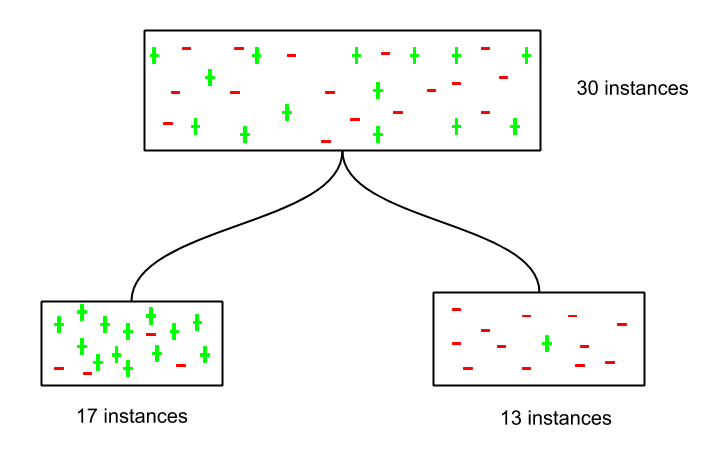

# Agenda

1. Decision-trees
2. Weighted models (revisited)
3. Dinner
4. Random forests
5. Bagged models
6. Group work

# Decision trees

## (Long) Setup
```{r setup, message=FALSE, warning=FALSE}
knitr::opts_chunk$set(echo = TRUE, message = FALSE, warning = FALSE)
library(tidyverse)
library(caret)
source('theme.R')

wine = read_rds("../resources/pinot.rds") %>% 
  rowid_to_column("id") 

wine_words <- function(df, j = 1000, stem=F){ 
  library(tidytext)
  library(SnowballC)
  data(stop_words)

  words <- df %>%
    unnest_tokens(word, description) %>%
    anti_join(stop_words) %>% # get rid of stop words
    filter(!(word %in% c("wine","pinot","vineyard")))
  
  if(stem){
    words <- words %>% 
      mutate(word = wordStem(word))
  }
  
  words <- words %>% 
    count(id, word) %>% 
    group_by(id) %>% 
    mutate(exists = (n>0)) %>% 
    ungroup %>% 
    group_by(word) %>% 
    mutate(total = sum(n)) %>% 
    filter(total > j) %>% 
    pivot_wider(id_cols = id, names_from = word, values_from = exists, values_fill = list(exists=0)) %>% 
    right_join(select(df,id,province)) %>% 
    select(-id) %>% 
    mutate(across(-province, ~replace_na(.x, F)))
}

wino <- wine_words(wine, j=2000, stem=F) %>% 
  filter(province %in% c("Oregon","California")) %>% 
  head() %>% 
  arrange(province)

wino
```

## Algorithm

1. Select the best attribute -> A 
2. Assign A as the decision attribute (test case) for the NODE. 
3. For each value of A, create a new descendant of the NODE. 
4. Sort the training examples to the appropriate descendant node leaf.
5. If examples are perfectly classified, then STOP else iterate over the new leaf nodes.

How do we find the best attribute?



## Information Gain

$InformationGain=Entropy(parent)-[AverageEntropy(children)]$

where,

$Entropy=\sum_{i=1}-(p_i)log(p_i)$

and $p$ is the proportion of the class under consideration.

For instance, the entropy of my sample is:

$Entropy(parent)=Entropy(2_c,4_o)=-(2/6)log(2/6)-(4/6)log(4/6)=0.36+0.27=0.63$

## Exercise

Let's try splitting on "fruit" and see what we get.

$Entropy(fruit)=Entropy(2_o,0_c)+Entropy(2_o,2_c)$

$=-(2/2)log(2/2)-(0/2)log(0/2)-(2/4)log(2/4)-(2/4)log(2/4)=-0-0-0.35-0.35$

So the information gain is $0.63-0.35=0.28$

Is this better than splitting on tannins first?


## Split the data 

```{r, message=F}
wino <- wine_words(wine, j=2000)
wine_index <- createDataPartition(wino$province, p = 0.80, list = FALSE)
train <- wino[ wine_index, ]
test <- wino[-wine_index, ]

table(train$province)
```

## Fit a basic model

```{r}
library(rpart)
ctrl <- trainControl(method = "cv")

fit <- train(province ~ .,
             data = train, 
             method = "rpart",
             trControl = ctrl,
             metric = "Kappa")

fit
```


```{r}
library(rpart.plot)
rpart.plot(fit$finalModel, type = 2)
```

## Confusion Matrix

```{r}
pred <- predict(fit, newdata=test)
confusionMatrix(factor(pred),factor(test$province))
```

Not bad... but what if we reduce the complexity constraint?

## Lower complexity

$cp = \sum_{leaves} Misclass_i+\lambda(Splits)$

```{r}
fit <- train(province ~ .,
             data = train, 
             method = "rpart",
             trControl = ctrl,
             tuneLength = 15,
             metric = "Kappa")

fit
rpart.plot(fit$finalModel, type = 2)

```

## Confusion Matrix

```{r}
pred <- predict(fit, newdata=test)
confusionMatrix(factor(pred),factor(test$province))
```

## Potential Overfitting

Should I prune on...

- Depth?
- Class size?
- Complexity?
- Minimum Information Gain?


# Weighted Models (revisited)

```{r}
weight_train <- train %>% 
  mutate(weights=case_when(
    province=="Burgundy" ~ 3,
    province=="California" ~ 1,
    province=="Casablanca_Valley" ~ 37,
    province=="Marlborough" ~ 18.5,
    province=="New_York" ~ 37,
    province=="Oregon" ~ 1.4))


fit <- train(province ~ .,
             data = train, 
             method = "rpart",
             tuneLength = 10,
             weights = weight_train$weights,
             trControl = ctrl)

fit
rpart.plot(fit$finalModel, type = 2)
```

## Confusion Matrix

```{r}
pred <- predict(fit, newdata=test)
confusionMatrix(factor(pred),factor(test$province))
```

# Dinner (and virtual high fives)


# Dealing with variance 


## Random Forest (subsets of features)


```{r}
library(randomForest)
fit <- train(province ~ .,
             data = train, 
             method = "rf",
             trControl = ctrl)

fit
```

## Confusion Matrix

```{r}
pred <- predict(fit, newdata=test)
confusionMatrix(factor(pred),factor(test$province))
```

## Bagging (subsets of data)

- "Bootstrap aggregating"
- Builds multiple models with bootstrap samples (combinations with repetitions) using a single algorithm. 
- The models’ predictions are combined with voting (for classification) or averaging (for numeric prediction). 
- Voting means the bagging model’s prediction is based on the majority of learners’ prediction for a class. 

## Treebag

```{r}

fit <- train(province ~ .,
             data = train, 
             trControl = ctrl,
             method = "treebag")

fit
pred <- predict(fit, newdata=test)
confusionMatrix(as.factor(pred),factor(test$province))
```

## Model Comparison

```{r}
library(doParallel)
cl <- makePSOCKcluster(3)
registerDoParallel(cl)
system.time({
  rpart.fit <- train(province~., data = train, method="rpart",trControl=ctrl);
  treebag.fit <- train(province~., data = train, method="treebag", trControl=ctrl);
  rf.fit <- train(province~., data = train, method="rf", trControl=ctrl);
})

stopCluster(cl) # close multi-core cluster
rm(cl)

results <- resamples(list(DecisionTree=rpart.fit, BaggedTree=treebag.fit, RandomForest=rf.fit))

# summary of model differences
summary(results)
```


## Summary

Pros

- Easy to use and understand. 
- Can handle both categorical and numerical data. 
- Resistant to outliers, hence require little data preprocessing. 
- New features can be easily added. 
- Can be used to build larger classifiers by using ensemble methods.

Cons

- Prone to overfitting. 
- Require some kind of measurement as to how well they are doing. 
- Need to be careful with parameter tuning. 
- Can create biased learned trees if some classes dominate.


# References

http://www.learnbymarketing.com/tutorials/rpart-decision-trees-in-r/
https://www.hackerearth.com/practice/machine-learning/machine-learning-algorithms/ml-decision-tree/tutorial/

