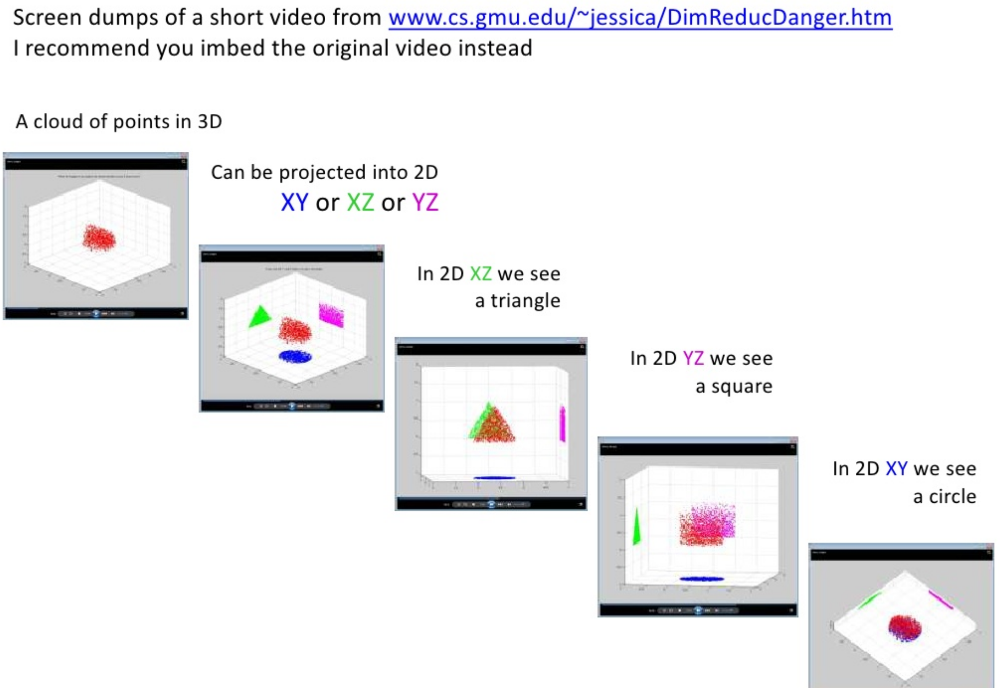
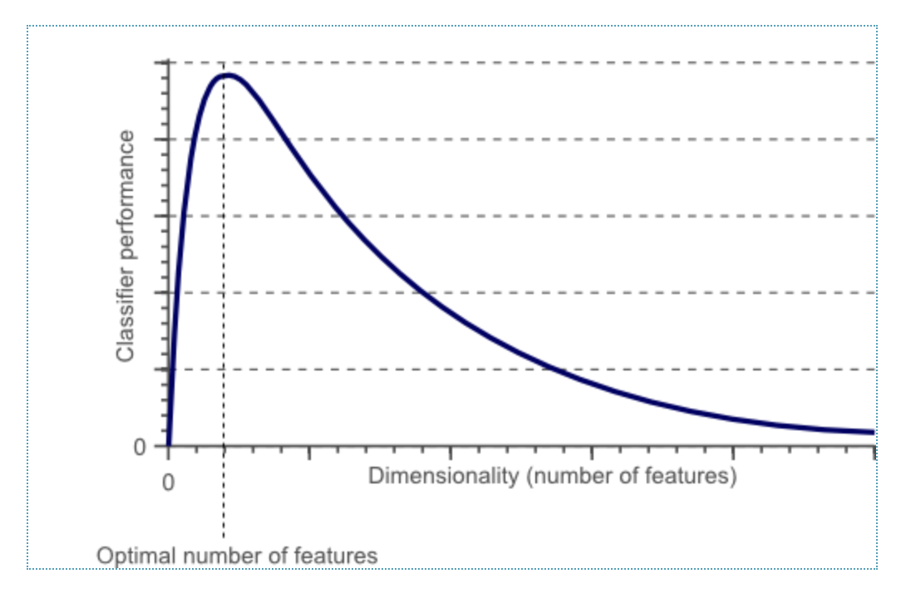
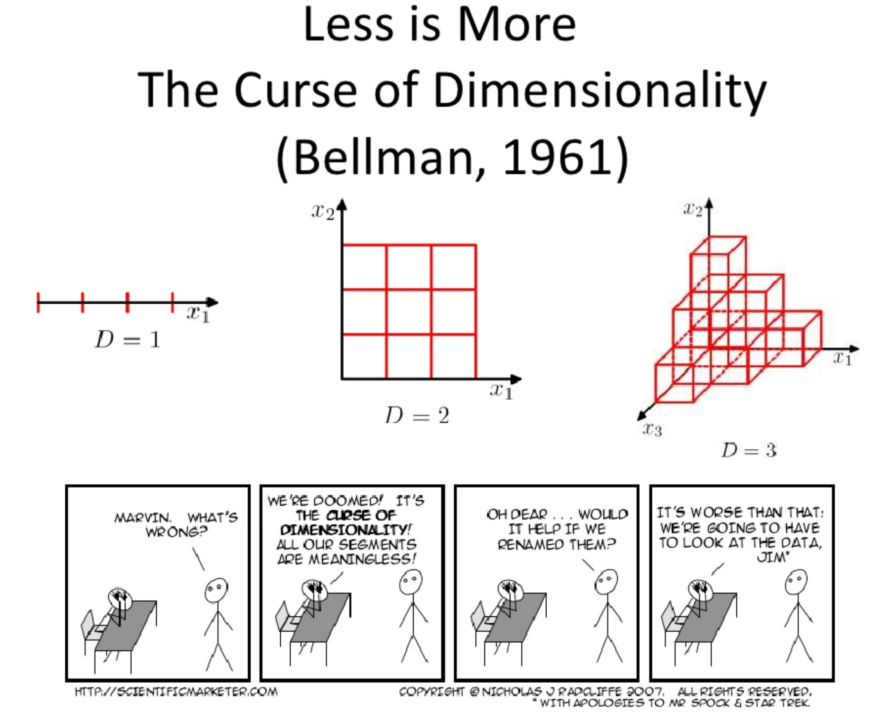

# Agenda

1. Review of Mid-term
2. Next modeling project
3. Principle component analysis
4. Topic modeling
5. Group breakout sessions (if time)

## But first...

Look for post about "tweener" lecture this week.

# Next modeling project

1. Due next Monday
2. Use bank data to predict churn
3. Using only 5 features
4. Models scored based on AUC

# Principle component analysis

What are the primary reasons to use PCA?

- Dimensionality reduction
- Visualization

## Curse of dimensionality

As the dimensionality of the feature space increases, the number of configurations can grow exponentially, and thus the number of configurations covered by an observation decreases. 







## Algorithm

1. Find a linear combination of variables to create principle components
2. Maintain as much variance as possible.
3. Principle components are orthogonal (uncorrelated)

## Rotation of orthogonal axes


## Setup
```{r setup, message=FALSE, warning=FALSE}
knitr::opts_chunk$set(echo = TRUE, message = FALSE, warning = FALSE)
library(tidyverse)
library(tidytext)
data(stop_words)

wine <- read_rds("../resources/variety.rds") %>% rowid_to_column("id") 
```

## Pull a bunch of words

```{r}
library(tidytext)
data(stop_words)

wine <- wine %>% 
  unnest_tokens(word, description) %>%
  anti_join(stop_words) %>%
  filter(!(word %in% c("drink","vineyard","variety","price","points","wine","pinot","chardonnay","gris","noir","riesling","syrah"))) %>% 
  count(id, word) %>% 
  group_by(word) %>% 
  mutate(total = sum(n)) %>% 
  filter(total > 500) %>% 
  ungroup %>% 
  group_by(id) %>% 
  mutate(exists = if_else(n>0,1,0)) %>% 
  ungroup %>% 
  pivot_wider(id_cols = id, names_from = word, values_from = exists, values_fill = c(exists=0)) %>% 
  right_join(wine, by="id") %>% 
  replace(.,is.na(.),0) %>% 
  mutate(log_price = log(price)) %>% 
  select(-id, -price, -description) 

names(wine)
```

## Run the principle component analysis

```{r}
pr_wine <- prcomp(x = select(wine,-variety), scale = T, center = T)
summary(pr_wine)
```

## Show variance plot

```{r}
screeplot(pr_wine, type = "lines")
```

## Visualize biplots

```{r}
 biplot(pr_wine)
 biplot(pr_wine, choices = c(3,4))
```

## Factor loadings

```{r}
pr_wine$rotation
```


## Loadings times values for all rows

```{r}
head(pr_wine$x)
```


## Add variety label to principle components and name them

```{r}
prc <- bind_cols(select(wine,variety),as.data.frame(pr_wine$x)) %>% 
  select(1:5) %>% 
  rename("quality" = PC1) %>% 
  rename("flavor" = PC2) %>% 
  rename("oak" = PC3) %>% 
  rename("tart" = PC4)
head(prc)
```

## Density of different components by variety (Factors 1&2)

```{r}
prc %>% 
  select(variety, quality, flavor) %>% 
  pivot_longer(cols = -variety,names_to = "component",values_to = "loading") %>% 
  ggplot(aes(loading, fill=variety))+
  geom_density(alpha=0.5)+
  facet_grid(.~component)

```

## Density of different components by variety (Factors 3&4)

```{r}
prc %>% 
  select(variety, oak, tart) %>% 
  pivot_longer(cols = -variety,names_to = "component",values_to = "loading") %>% 
  ggplot(aes(loading, fill=variety))+
  geom_density(alpha=0.5)+
  facet_grid(.~component)

```

## What if we add back more words (features)?

```{r}
wine <- read_rds("../resources/variety.rds") %>% rowid_to_column("id") 
wine <- wine %>% 
  unnest_tokens(word, description) %>%
  anti_join(stop_words) %>%
  filter(!(word %in% c("drink","vineyard","variety","price","points","wine","pinot","chardonnay","gris","noir","riesling","syrah"))) %>% 
  count(id, word) %>% 
  group_by(word) %>% 
  mutate(total = sum(n)) %>% 
  filter(total > 100) %>% 
  ungroup %>% 
  group_by(id) %>% 
  mutate(exists = if_else(n>0,1,0)) %>% 
  ungroup %>% 
  pivot_wider(id_cols = id, names_from = word, values_from = exists, values_fill = c(exists=0)) %>% 
  right_join(wine, by="id") %>% 
  replace(.,is.na(.),0) %>% 
  mutate(log_price = log(price)) %>% 
  select(-id, -price, -description) 

names(wine)
```

## Run the principle component analysis

```{r}
pr_wine <- prcomp(x = select(wine,-variety), scale = T, center = T)
screeplot(pr_wine, type = "lines")
```

## Find the features with the highest loadings per factor

```{r}
rownames_to_column(as.data.frame(pr_wine$rotation)) %>% 
  select(1:5) %>% 
  filter(abs(PC1) >= 0.25 | abs(PC2) >= 0.25 | abs(PC3) >= 0.25 | abs(PC4) >= 0.25)

```


## Name and graph the factors
```{r}

prc <- bind_cols(select(wine,variety),as.data.frame(pr_wine$x)) %>% 
  select(1:5) %>% 
  rename("pricey"=PC1, "quality_french_oak"=PC2, "crappy_french_oak"=PC3, "willamette_valley"=PC4)


prc %>% 
  select(variety, pricey,willamette_valley) %>% 
  pivot_longer(cols = -variety,names_to = "component",values_to = "loading") %>% 
  ggplot(aes(loading, fill=variety))+
  geom_density(alpha=0.5)+
  facet_grid(.~component)

prc %>% 
  select(variety, quality_french_oak, crappy_french_oak) %>% 
  pivot_longer(cols = -variety,names_to = "component",values_to = "loading") %>% 
  ggplot(aes(loading, fill=variety))+
  geom_density(alpha=0.5)+
  facet_grid(.~component)


```

## Use these 4 factors for prediction

```{r}
library(caret)
fit <- train(variety ~ .,
             data = prc, 
             method = "naive_bayes",
             metric = "Kappa",
             trControl = trainControl(method = "cv"))

confusionMatrix(predict(fit, prc),factor(prc$variety))

```

...not bad!!!

# Dinner (and virtual high fives)



# (Long) Exercise

1. Load the bank data
2. Run a principal component analysis on all the data except Churn
3. Choose a number of factors based on a scree plot
4. name those factors
5. Plot them against Churn using a density plot

# Topic Modeling


Credit: https://towardsdatascience.com/dimensionality-reduction-with-latent-dirichlet-allocation-8d73c586738c


## Latent Dirichlet allocation

Latent Dirichlet allocation is one of the most common algorithms for topic modeling. Without diving into the math behind the model, we can understand it as being guided by two principles.

1. Every document is a mixture of topics. We imagine that each document may contain words from several topics in particular proportions. For example, in a two-topic model we could say “Document 1 is 90% topic A and 10% topic B, while Document 2 is 30% topic A and 70% topic B.”
    
2. Every topic is a mixture of words. For example, we could imagine a two-topic model of American news, with one topic for “politics” and one for “entertainment.” The most common words in the politics topic might be “President”, “Congress”, and “government”, while the entertainment topic may be made up of words such as “movies”, “television”, and “actor”. Importantly, words can be shared between topics; a word like “budget” might appear in both equally.

See: https://www.tidytextmining.com/topicmodeling.html#latent-dirichlet-allocation

LDA is a mathematical method for estimating both of these at the same time: finding the mixture of words that is associated with each topic, while also determining the mixture of topics that describes each document. 

## Running a model

```{r}
library(topicmodels)

wine_dtm <- read_rds("../resources/variety.rds") %>% rowid_to_column("id") %>% 
  unnest_tokens(word, description) %>%
  anti_join(stop_words) %>%
  filter(!(word %in% c("drink","vineyard","variety","price","points","wine","pinot","chardonnay","gris","noir","riesling","syrah"))) %>% 
  count(id,word) %>% 
  cast_dtm(id, word, n)

wine_lda <- LDA(wine_dtm, k = 4, control = list(seed = 5004))
wine_lda
```

## Word-topic probabilities

```{r}
topics <- tidy(wine_lda, matrix = "beta")
head(topics)

top_terms <- topics %>%
  group_by(topic) %>%
  top_n(10, beta) %>%
  ungroup() %>%
  arrange(topic, -beta)

top_terms %>%
  mutate(term = reorder_within(term, beta, topic)) %>%
  ggplot(aes(term, beta, fill = factor(topic))) +
  geom_col(show.legend = FALSE) +
  facet_wrap(~ topic, scales = "free") +
  coord_flip() +
  scale_x_reordered()
```


## Document-topic probabilities

```{r}
topics <- tidy(wine_lda, matrix = "gamma")
head(topics)
```

## What if we pivot wider?

```{r, message=F}
wine <- read_rds("../resources/variety.rds") %>% rowid_to_column("id")

topics <- topics %>% 
  pivot_wider(id_cols = document,names_from = topic,values_from = gamma, names_prefix = "topic_") %>% 
  mutate(id=as.integer(document)) %>%
  left_join(select(wine, id, variety)) %>% 
  select(-document, -id)

head(topics)
```


## Can we use topics to model an outcome?

```{r}
fit <- train(variety ~ .,
             data = topics, 
             method = "naive_bayes",
             metric = "Kappa",
             trControl = trainControl(method = "cv"))

confusionMatrix(predict(fit, topics),factor(topics$variety))

```

## What if we used more topics?

```{r}
wine_lda <- LDA(wine_dtm, k = 20, control = list(seed = 5004))

topics <- tidy(wine_lda, matrix = "gamma") %>% 
  pivot_wider(id_cols = document,names_from = topic,values_from = gamma, names_prefix = "topic_") %>% 
  mutate(id=as.integer(document)) %>% 
  left_join(select(wine, id, variety)) %>% 
  select(-document, -id)

fit <- train(variety ~ .,
             data = topics, 
             method = "naive_bayes",
             metric = "Kappa",
             trControl = trainControl(method = "cv"))

confusionMatrix(predict(fit, topics),factor(topics$variety))
```

## What if we allow price and points back in?

```{r}
topics <- tidy(wine_lda, matrix = "gamma") %>% 
  pivot_wider(id_cols = document,names_from = topic,values_from = gamma, names_prefix = "topic_") %>% 
  mutate(id=as.integer(document)) %>% 
  left_join(wine) %>% 
  mutate(log_price = log(price)) %>% 
  select(-document, -id, -description, -price)

fit <- train(variety ~ .,
             data = topics, 
             method = "naive_bayes",
             metric = "Kappa",
             trControl = trainControl(method = "cv"))

confusionMatrix(predict(fit, topics),factor(topics$variety))
```

# Breakout Sessions


