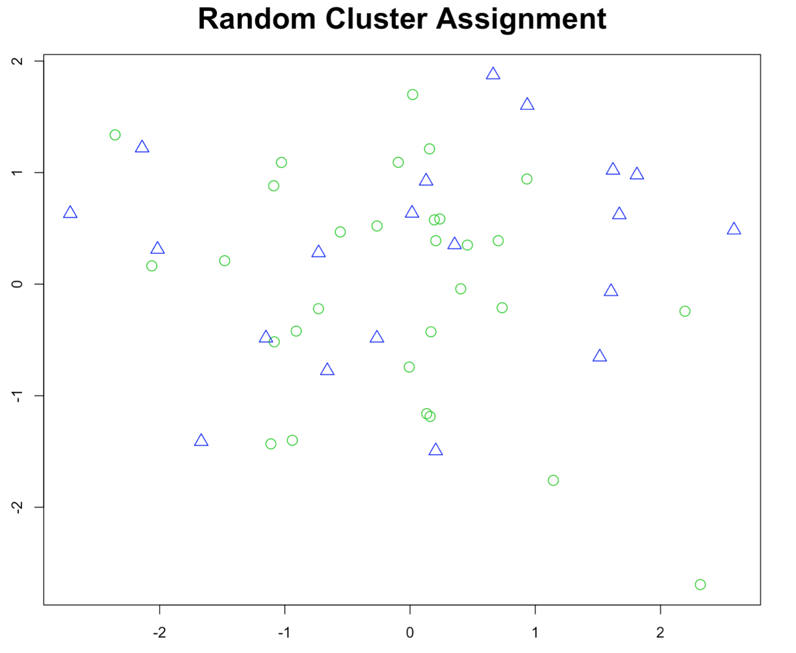
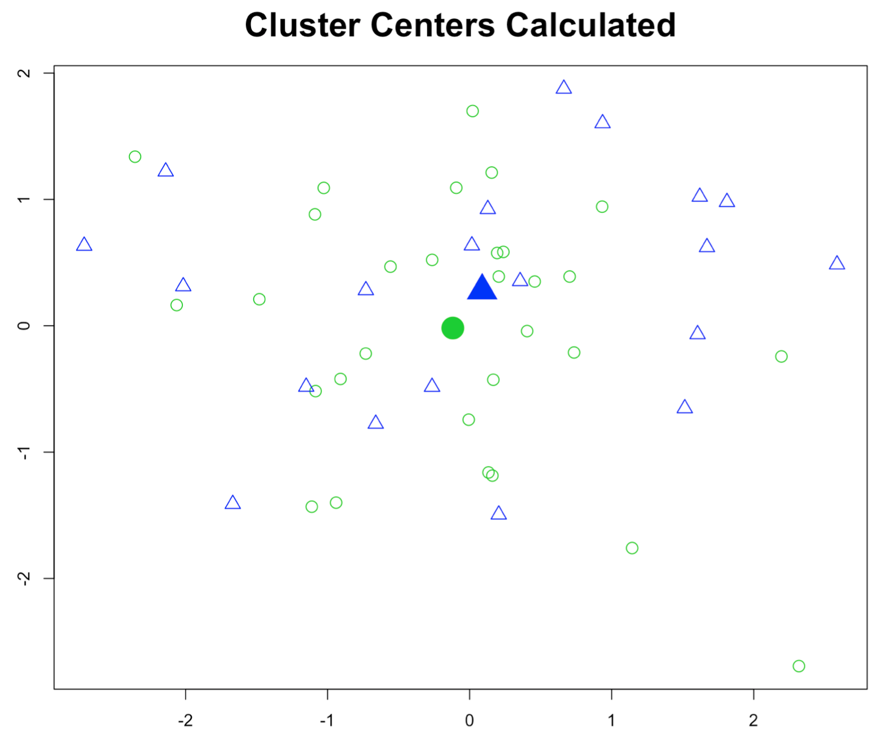
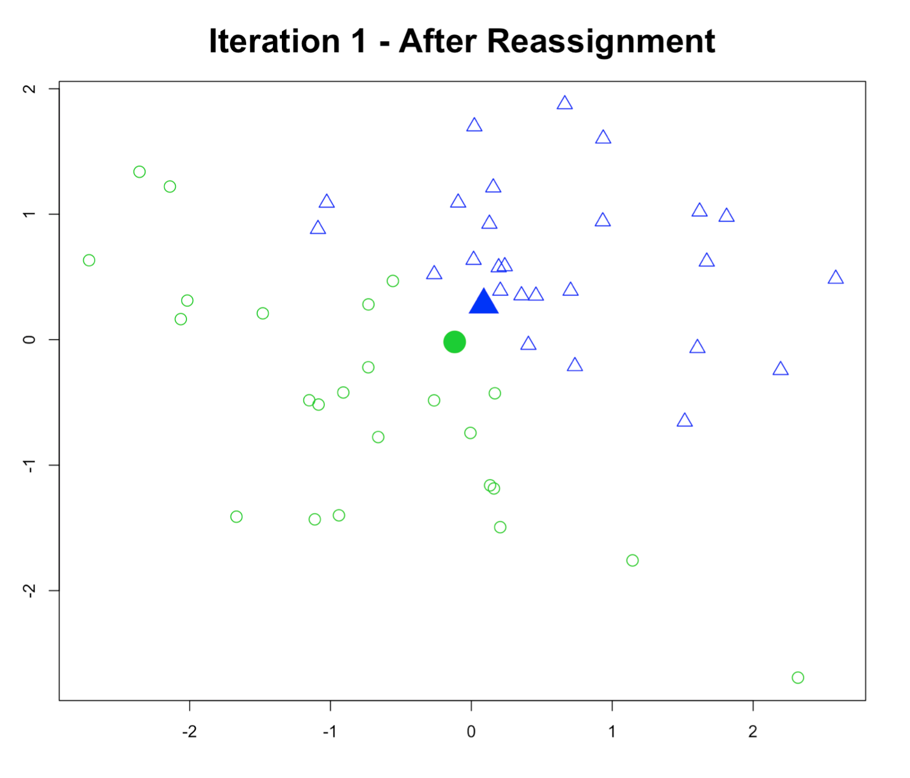
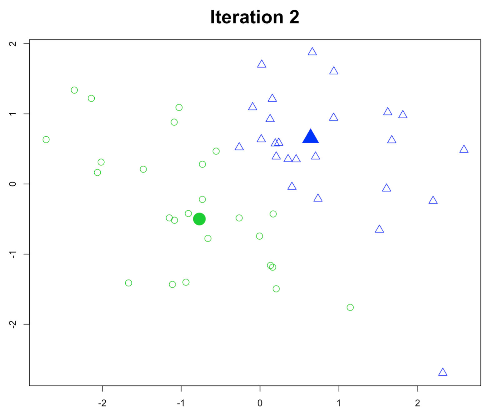
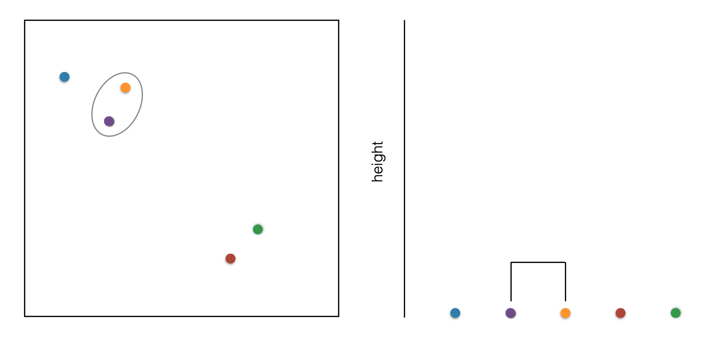
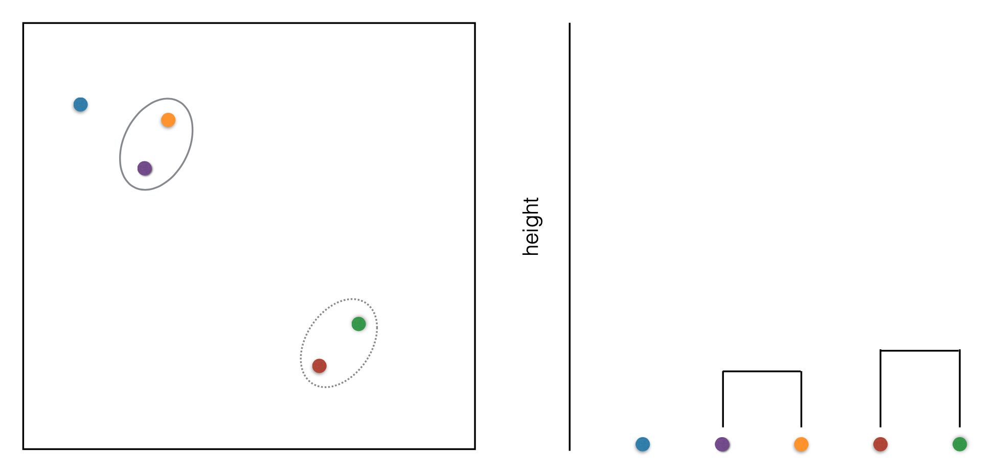
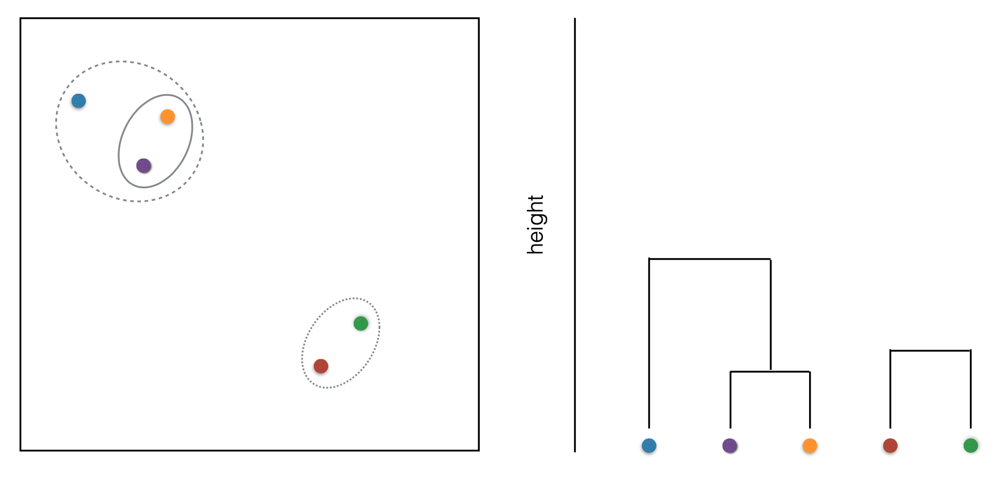
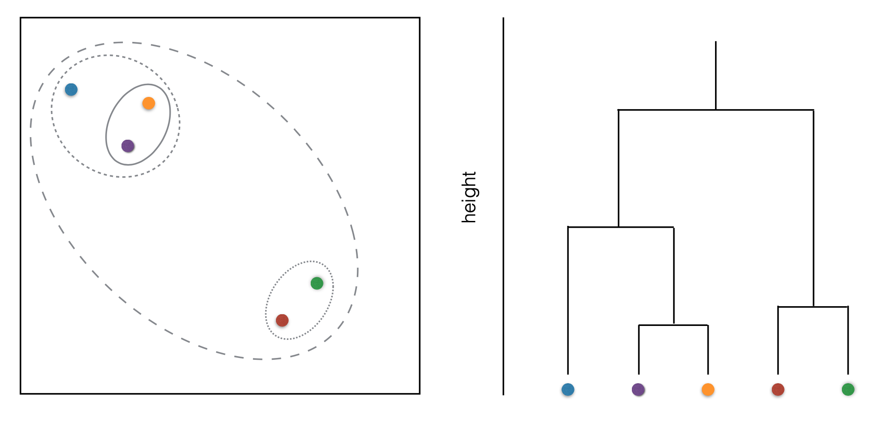

<style>
strong{
  color: #018080;
}
table.rmdtable th {
    background: #791716;
}

</style>

## Agenda

1. Unsupervised Learning
2. K-means Clustering
3. Hierarchical Clustering
4. Second Modeling Project


# But first...

- Comments on modeling project
  - Leakage
  - Consistent # of rows
  - Creativity
- Review of the mid-term

# Unsupervised Learning

1. What is difference between supervised and unsupervised learning?
2. What is unsupervised learning used for?
3. What are some challenges with unsupervised learning?

# K-means Clustering Algorithm

## Start with k random clusters



## Calculate means



## Select cluster based on which mean point is closest to



## Adjust menas and repeat



## Potential Issues

- What happens with high dimensionality?
- What happens when dimensions aren't scaled?


## Setup
```{r setup, message=FALSE, warning=FALSE}
knitr::opts_chunk$set(echo = TRUE, message = FALSE, warning = FALSE)
library(tidyverse)
library(tidytext)
data(stop_words)

wine <- read_rds("../resources/variety-project.rds") %>% 
  rowid_to_column("id")

glimpse(wine)
```

## Find top words in each variety
```{r}
top_words <- wine %>%
  unnest_tokens(word, description) %>%
  anti_join(stop_words) %>% 
  filter(!(word %in% c("wine","flavors"))) %>% 
  count(id, word) %>% 
  group_by(id) %>% 
  mutate(exists = if_else(n>0,1,0)) %>% 
  ungroup %>% 
  right_join(wine, by="id") %>%
  count(variety, word) %>% 
  group_by(variety) %>% 
  top_n(2,n) %>%
  ungroup %>% 
  select(word) %>% 
  distinct()

top_words
```

## Create features from top words

```{r}
wino <- wine %>%
  unnest_tokens(word, description) %>%
  anti_join(stop_words) %>% 
  filter(word %in% top_words$word) %>% 
  count(id, word) %>% 
  group_by(id) %>% 
  mutate(exists = if_else(n>0,1,0)) %>% 
  ungroup %>% 
  pivot_wider(id_cols = id, names_from = word, values_from = exists, values_fill = c(exists=0)) %>% 
  right_join(wine, by="id") %>% 
  replace(.,is.na(.),0) %>% 
  mutate(price=log(price)) %>%
  mutate(price=scale(price), points=scale(points)) %>% 
  select(-id,-variety, -description) 
```

## Look at the data

```{r}
head(wino)
```

## Basic K-means cluster

```{r}
kclust <- kmeans(wino, centers = 3)
kclust$centers
glance(kclust)
```

## Add clusters to original dataset (from Broom)

```{r}
wink <- augment(kclust,wino)
head(wink)
```

## Visualize clusters

```{r}
wink %>% 
  pivot_longer(c(apple,cherry,dry),names_to = "feature") %>% 
  ggplot(aes(value, fill=.cluster))+
  geom_density(alpha=0.3)+
  facet_wrap(~feature)

wink %>% 
  pivot_longer(c(finish, fruit, pear),names_to = "feature") %>% 
  ggplot(aes(value, fill=.cluster))+
  geom_density(alpha=0.3)+
  facet_wrap(~feature)


wink %>% 
  pivot_longer(c(points,price),names_to = "feature") %>% 
  ggplot(aes(value, fill=.cluster))+
  geom_density(alpha=0.3)+
  facet_wrap(~feature)
```

## Try different numbers of clusters

```{r}
kclusts <- tibble(k = 1:9) %>%
  mutate(
    kclust = map(k, ~kmeans(wino, .x)),
    glanced = map(kclust, glance),
    augmented = map(kclust, augment, wino)
  )

```

## Plot the different clusters on two axes

```{r}

assignments <- kclusts %>% 
  unnest(augmented)

ggplot(assignments, aes(price, points)) +
  geom_point(aes(color = .cluster), alpha=0.3) + 
  facet_wrap(~ k)

```

## Look at improvement in within-cluster error

```{r}
clusterings <- kclusts %>%
  unnest(glanced, .drop = TRUE)

ggplot(clusterings, aes(k, tot.withinss)) +
  geom_line()
```


#### - What are some real world applications of clustering?
#### - How might I choose number of clusters in practice?

# Hierarchical Clustering









## Create the hierarchical cluster

```{r}
swine <- wino %>% 
  sample_n(200)
  
hclustr <- hclust(d=dist(swine))
summary(hclustr)
```

## Plot the dendrogram

```{r}
plot(hclustr)
abline(h=3, col="red")
```

## Assign clusters
```{r}
hclustr <- hclust(d=dist(wino))
cluster <- cutree(hclustr, k=5)
swine <- wino %>% 
  add_column(cluster) %>% 
  mutate(cluster=as_factor(cluster))

head(swine)
```

## Visualize clusters

```{r}
swine %>% 
  pivot_longer(c(apple,cherry,dry),names_to = "feature") %>% 
  ggplot(aes(value, fill=cluster))+
  geom_density(alpha=0.3)+
  facet_wrap(~feature)

swine %>% 
  pivot_longer(c(finish, fruit, pear),names_to = "feature") %>% 
  ggplot(aes(value, fill=cluster))+
  geom_density(alpha=0.3)+
  facet_wrap(~feature)


swine %>% 
  pivot_longer(c(points,price),names_to = "feature") %>% 
  ggplot(aes(value, fill=cluster))+
  geom_density(alpha=0.3)+
  facet_wrap(~feature)
```

### What do you see as some of the issues with Hierarchical clustering?


# Next Modeling Project

Predicting oregon wine variety.

1. Using the "variety-project.rds" file on WISE
2. Predict the variety of an Oregon wine
3. using only 10 features
4. and a decision tree.*

* I may impose some limits on parameters (i.e. depth)

# References

https://cran.r-project.org/web/packages/broom/vignettes/kmeans.html


