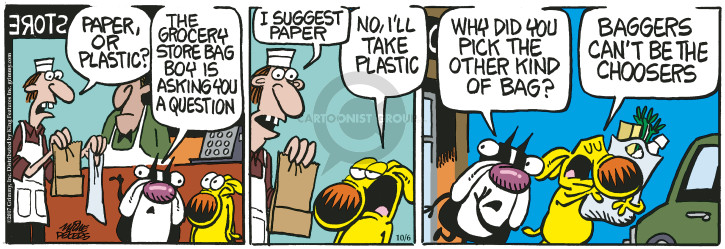

## Agenda

1. Last group modeling assignment (plus Exam?)
2. Review of TidyModels
3. Bagging, Boosting and Ensembles
4. Breakout sessions for last modeling assignment


# Last Modeling Assignment

1. Predict the profit of future products developed at CravenSpeed
2. Using any model (or ensemble) you'd like
3. Evaluated using RMSE on holdout sample (you won't see)

**Present:**

A maximum of 15 slides (powerpoint or html), without any code, that demonstrates 

- how and why you created/selected the features used
- the choice and design of your model
- results and insights for management

**Rules:** 

- Every group member must participate in the presentation
- Maximum 10 features including interactions
- Turn in RMD file on Saturday the 24th by midnight
- I release holdout sample Sunday morning
- Turn in Presentation and an RMD file with RMSE calculated on holdout sample by 6pm Monday the 26th
- 20 points for the model, 20 points for the presentation

# Review of TidyModels on a linear model

# Setup
```{r setup, message=FALSE, warning=FALSE}
knitr::opts_chunk$set(echo = TRUE, message = FALSE, warning = FALSE)
library(tidymodels)
library(tidyverse)
wine = read_rds("../resources/pinot.rds") %>% 
  select(-taster_name) %>% 
  mutate(year_f = as.factor(year)) %>% 
  mutate(cherry = str_detect(description,"cherry")) %>% 
  mutate(chocolate = str_detect(description,"chocolate")) %>%
  mutate(earth = str_detect(description,"earth")) %>%
  mutate(lprice = log(price)) %>% 
  select(-description, -price)
```

## Some basic features

```{r}
glimpse(wine)
```
## First let's split the data
```{r}
set.seed(504)
data_split <- initial_split(wine, prop = 3/4)
train <- training(data_split)
test  <- testing(data_split)
```

## The create the recipe, model and workflow

```{r}

wine_rec <- 
  recipe(lprice ~ ., data = train) %>% 
  step_BoxCox(all_numeric(), -all_outcomes()) %>% 
  step_interact(terms = ~ province:year) %>% 
  step_dummy(all_nominal(), -all_outcomes()) %>%  # dummy variables for all factor/character/logical columns except for the outcome
  step_zv(all_predictors()) # remove all zero variance predictors (i.e. low frequency dummies)

lm_spec <- 
  linear_reg() %>% 
  set_engine("lm")

wine_wflow <- 
  workflow() %>% 
  add_model(lm_spec) %>% 
  add_recipe(wine_rec)

wine_wflow
```

## Use the workflow to train our model

```{r}
wine_fit <- fit(wine_wflow, train)

wine_fit %>% ## display results
  pull_workflow_fit() %>% 
  tidy() 
```

## Evaluate the model on our training data
```{r}
wine_pred <- predict(wine_fit, test %>% select(-lprice)) 
head(wine_pred)

```
## Combine the predictions with the original to see the errors
```{r}
wine_results <- bind_cols(wine_pred, test %>% select(lprice))
head(wine_results)
```

## Graph the errors

```{r}
ggplot(wine_results, aes(x = lprice, y = .pred)) + 
  # Create a diagonal line:
  geom_abline(lty = 2) + 
  geom_point(alpha = 0.5) + 
  labs(y = "Predicted log Sale Price", x = "log Sale Price") +
  # Scale and size the x- and y-axis uniformly:
  coord_obs_pred()
```

## Show the performance metrics

```{r}
wine_metrics <- metric_set(rmse, rsq, mae)
wine_metrics(wine_results, truth = lprice, estimate = .pred)
```

# Testing Multiple Models

## Create Several Specifications and Recipes

```{r}
#subsampling spec
wine_folds <- vfold_cv(train, v = 2)

#recipes
basic_rec <- 
  recipe(lprice ~ ., data = train) %>% 
  step_dummy(all_nominal(), -all_outcomes()) 

complicated_rec <- 
  recipe(lprice ~ ., data = train) %>% 
  step_BoxCox(all_numeric(), -all_outcomes()) %>% 
  step_interact(~ province:year) %>% 
  step_dummy(all_nominal(), -all_outcomes()) %>%  # dummy variables for all factor/character/logical columns except for the outcome
  step_zv(all_predictors()) # remove all zero variance predictors (i.e. low frequency dummies)

lm_spec <- 
  linear_reg() %>% 
  set_engine("lm")

dt_spec <- 
  decision_tree(
    cost_complexity = tune(),
    tree_depth = tune()
    ) %>% 
  set_engine("rpart") %>% 
  set_mode("regression")

# knn_spec <- 
#    nearest_neighbor(
#      neighbors = tune()
#      ) %>% 
#    set_engine("kknn") %>% 
#    set_mode("regression")

```

## Create a set of workflows

```{r}
library(workflowsets)

wine_workflows <- 
   workflow_set(
      preproc = list(basic = basic_rec, complicated = complicated_rec), 
      models = list(LM = lm_spec, DT = dt_spec)
   )
wine_workflows
```
## Build the tune grid

```{r}
grid_ctrl <-
   control_grid(
      save_pred = TRUE,
      parallel_over = "everything",
      save_workflow = TRUE
   )

grid_results <-
   wine_workflows %>%
   workflow_map(
      seed = 504,
      resamples = wine_folds,
      grid = 10,
      control = grid_ctrl
   )

grid_results %>% 
   rank_results() %>% 
   filter(.metric == "rmse") %>% 
   select(model, .config, rmse = mean, rank)
```
## Visualize Model Performance

```{r}
autoplot(
   grid_results,
   rank_metric = "rmse",  # <- how to order models
   metric = "rmse",       # <- which metric to visualize
   select_best = TRUE     # <- one point per workflow
)
```

## Pull the best model

```{r}
best_results <- 
   grid_results %>% 
   pull_workflow_set_result("basic_DT") %>% 
   select_best(metric = "rmse")
best_results
```

## Fit it to the training set
```{r}
test_results <- 
   grid_results %>% 
   pull_workflow("basic_DT") %>% 
   finalize_workflow(best_results) %>% 
   last_fit(split = data_split)

collect_metrics(test_results)

test_results %>% 
   collect_predictions() %>% 
   ggplot(aes(x = lprice, y = .pred)) + 
   geom_abline(col = "green", lty = 2) + 
   geom_point(alpha = 0.5) + 
   coord_obs_pred() + 
   labs(x = "observed", y = "predicted")
```

# Dinner Break (and virtual high fives)




# Bagging, Boosting and Custom Ensembles


The goal is to decrease the variance (bagging) or bias (boosting) in our models.

- Step 1: producing a distribution of simple ML models on subsets of the original data.
- Step 2: combine the distribution into one “aggregated” model.

**Note:** Subtle difference between Bagging/Boosting and resampling.

Re-sampling --> average coefficients from different subsamples to create one model

vs.

Bagging/Boosting --> average the predictions from different models


## Bagging

- Bootstrap aggregating
- Builds multiple models with bootstrap samples (combinations with repetitions) using a single algorithm. 
- The models’ predictions are combined with voting (for classification) or averaging (for numeric prediction). 
- Voting means the bagging model’s prediction is based on the majority of learners’ prediction for a class. 

 the predictions

## Treebag

```{r}
library(stacks)
folds <- vfold_cv(train, v = 3)
metric <- metric_set(rmse)
# ctrl_res <- control_resamples()

library(baguette)

bag_spec <- 
   bag_tree() %>% 
   set_engine("rpart", times = 50L) %>% 
   set_mode("regression")

wine_wflow <- 
  workflow() %>% 
  add_model(bag_spec) %>% 
  add_recipe(wine_rec)

bag_res <- 
  fit_resamples(
    wine_wflow,
    resamples = folds,
    metrics = metric,
    control = control_stack_resamples()
  )

bag_res %>% 
  collect_metrics() 

```


## Boosting

> A horse-racing gambler, hoping to maximize his winnings, decides to create a computer program that will accurately predict the winner of a horse race based on the usual information (number of races recently won by each horse, betting odds for each horse, etc.). To create such a program, he asks a highly successful expert gambler to explain his betting strategy. Not surprisingly, the expert is unable to articulate a grand set of rules for selecting a horse. On the other hand, when presented with the data for a specific set of races, the expert has no trouble coming up with a “rule of thumb” for that set of races (such as, “Bet on the horse that has recently won the most races” or “Bet on the horse with the most favored odds”). Although such a rule of thumb, by itself, is obviously very rough and inaccurate, it is not unreasonable to expect it to provide predictions that are at least a little bit better than random guessing. Furthermore, by repeatedly asking the expert’s opinion on different collections of races, the gambler is able to extract many rules of thumb.

> In order to use these rules of thumb to maximum advantage, there are two problems faced by the gambler:

> First, how should he choose the collections of races presented to the expert so as to extract rules of thumb from the expert that will be the most useful?

> Second, once he has collected many rules of thumb, how can they be combined into a single, highly accurate prediction rule?

> Boosting refers to a general and provably effective method of producing a very accurate prediction rule by combining rough and moderately inaccurate rules of thumb in a manner similar to that suggested above

https://cseweb.ucsd.edu/~yfreund/papers/IntroToBoosting.pdf


## Random Forest (several deep trees, limited features)

```{r}
library(ranger)

rf_spec <- 
   rand_forest() %>% 
   set_engine("ranger") %>% 
   set_mode("regression")

wine_wflow <- 
  workflow() %>% 
  add_model(rf_spec) %>% 
  add_recipe(wine_rec)

rf_res <- 
  fit_resamples(
    wine_wflow,
    resamples = folds,
    metrics = metric,
    control = control_stack_resamples()
  )

rf_res %>% 
  collect_metrics() 

```

## Gradient Boosting (many, many shallow trees, all features)
```{r}
xgb_spec <- 
   boost_tree() %>% 
   set_engine("xgboost") %>% 
   set_mode("regression")

wine_wflow <- 
  workflow() %>% 
  add_model(xgb_spec) %>% 
  add_recipe(wine_rec)

xgb_res <- 
  fit_resamples(
    wine_wflow,
    resamples = folds,
    metrics = metric,
    control = control_stack_resamples()
  )

xgb_res %>% 
  collect_metrics() 

```

## Custom Ensemble

Fits a LASSO model on the stack

```{r}

wine_data_st <- 
  stacks() %>%
  add_candidates(bag_res) %>%
  add_candidates(rf_res) %>%
  add_candidates(xgb_res)

wine_model_st <-
  wine_data_st %>%
  blend_predictions()

autoplot(wine_model_st, type = "weights")
```

## Fit it!

```{r}
wine_model_st_fit <-
  wine_model_st %>%
  fit_members()

wine_model_st_fit 
```


```{r}
wine_pred <- predict(wine_model_st_fit, test)

wine_results <- bind_cols(wine_pred, test %>% select(lprice))
head(wine_results)
```

## Graph the errors

```{r}
ggplot(wine_results, aes(x = lprice, y = .pred)) + 
  # Create a diagonal line:
  geom_abline(lty = 2) + 
  geom_point(alpha = 0.5) + 
  labs(y = "Predicted log Sale Price", x = "log Sale Price") +
  # Scale and size the x- and y-axis uniformly:
  coord_obs_pred()
```

## Show the performance metrics

```{r}
wine_metrics <- metric_set(rmse, rsq, mae)
wine_metrics(wine_results, truth = lprice, estimate = .pred)
```

